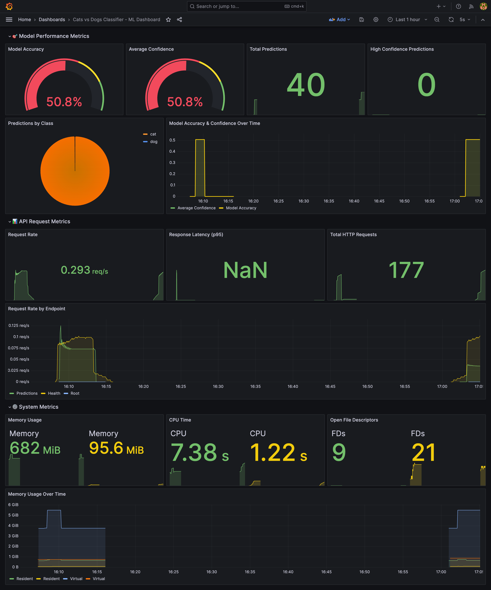
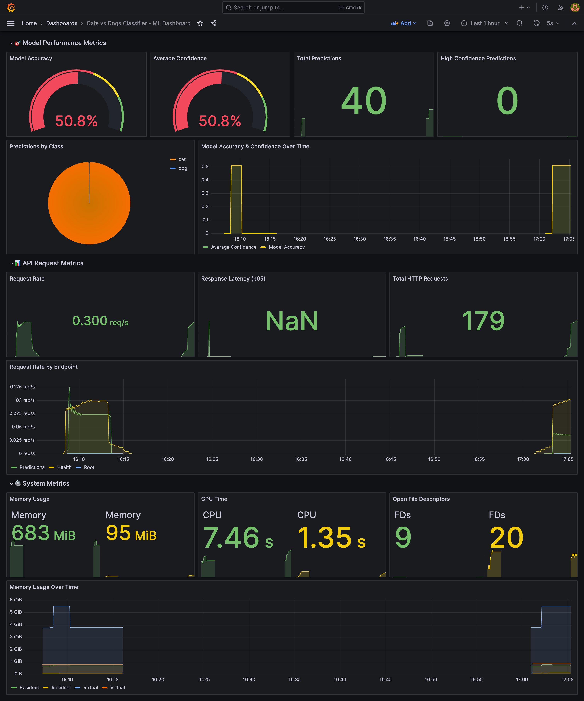
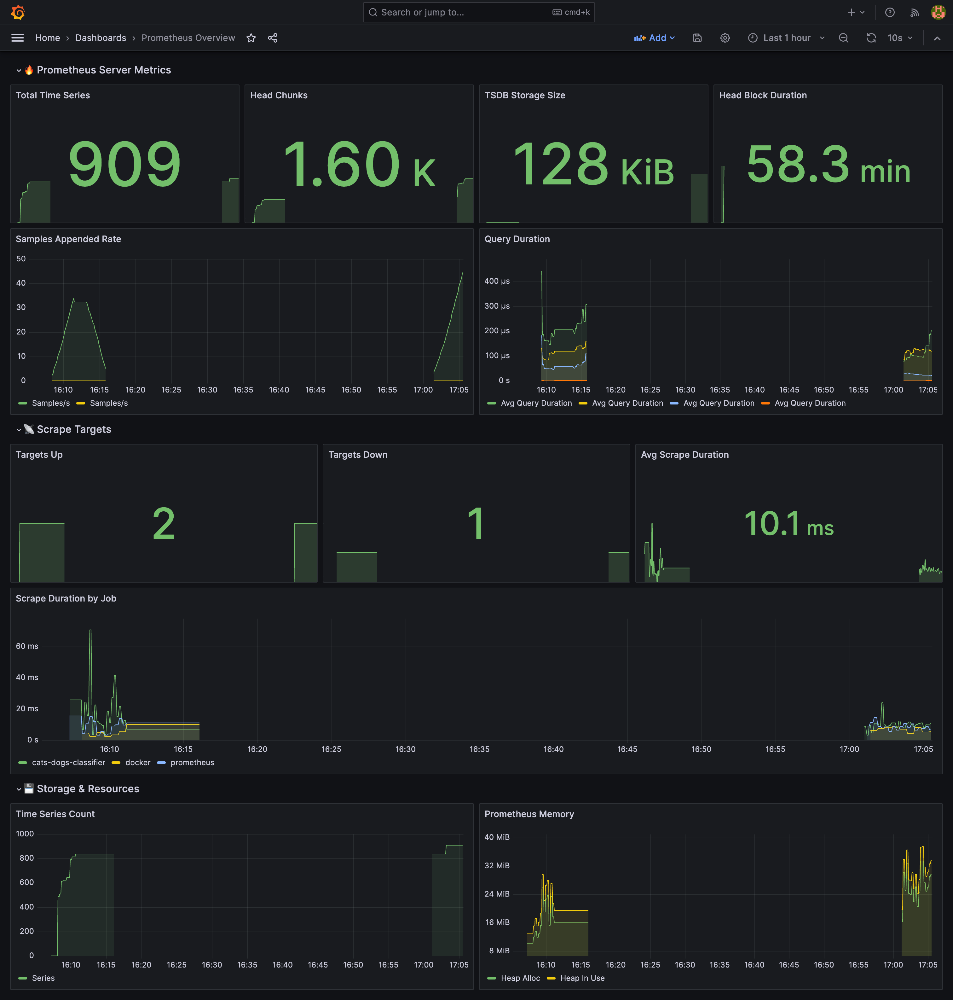
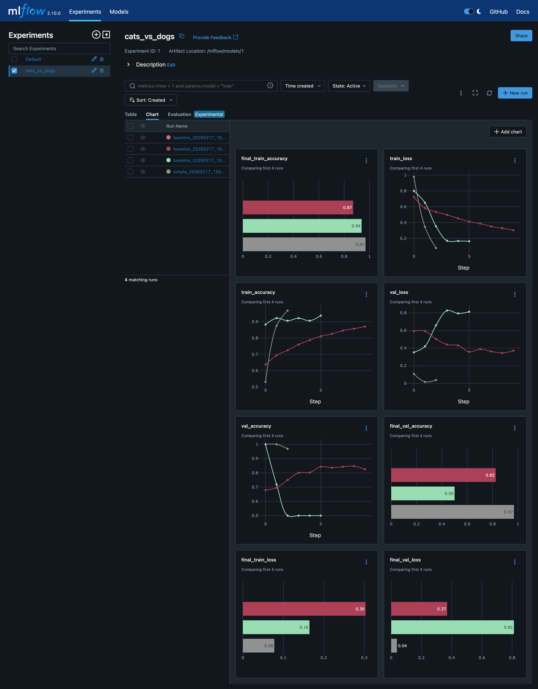
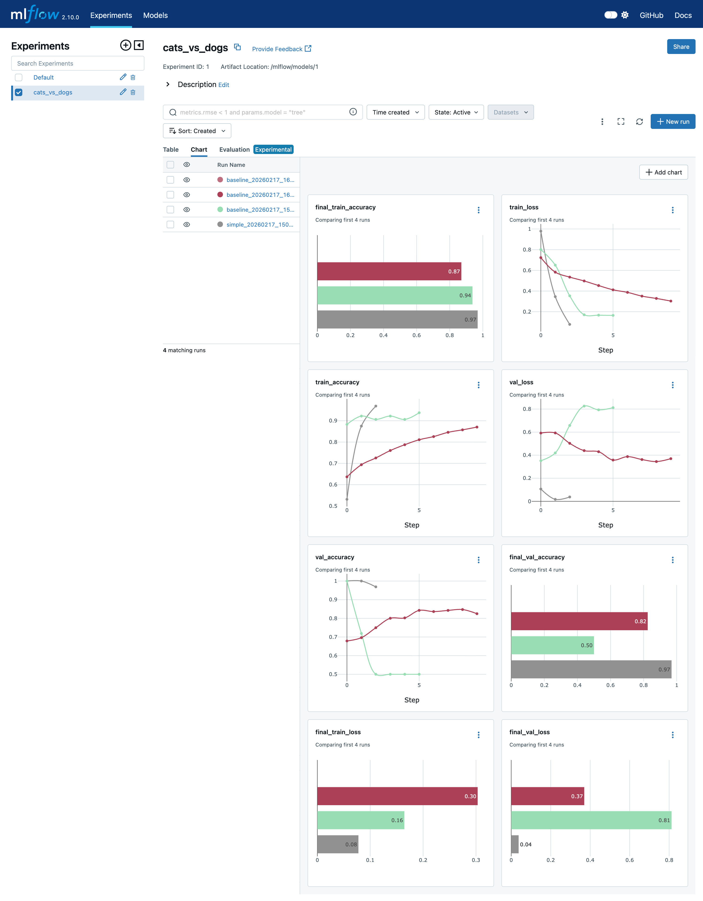
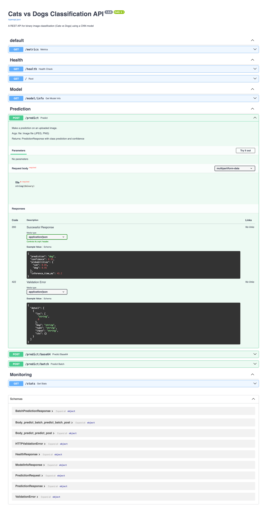
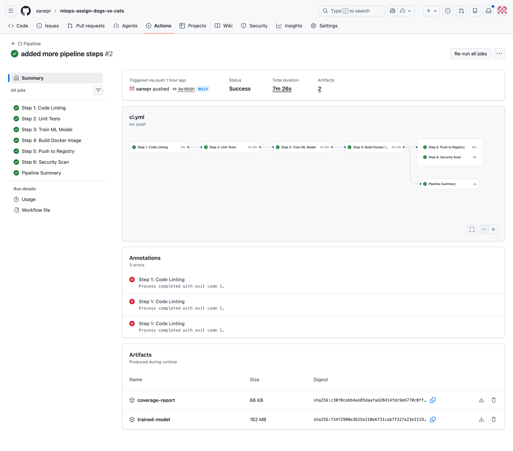

# Cats vs Dogs Classification - MLOps Pipeline

A complete end-to-end MLOps pipeline for binary image classification (Cats vs Dogs) for a pet adoption platform.


## 📋 Table of Contents

- [Project Overview](#project-overview)
- [Project Structure](#project-structure)
- [Quick Start](#quick-start)
- [Milestones](#milestones)
  - [M1: Model Development & Experiment Tracking](#m1-model-development--experiment-tracking)
  - [M2: Model Packaging & Containerization](#m2-model-packaging--containerization)
  - [M3: CI Pipeline](#m3-ci-pipeline)
  - [M4: CD Pipeline & Deployment](#m4-cd-pipeline--deployment)
  - [M5: Monitoring & Logging](#m5-monitoring--logging)
- [API Documentation](#api-documentation)
- [Testing](#testing)
- [Deployment](#deployment)
- [Screenshots](#screenshots)

## 🎯 Project Overview

This project implements a complete MLOps pipeline with:

- **Dataset**: Cats and Dogs classification dataset from Kaggle
- **Preprocessing**: 224x224 RGB images with data augmentation
- **Model**: CNN-based binary classifier
- **Serving**: REST API with FastAPI
- **Infrastructure**: Docker, Kubernetes
- **CI/CD**: GitHub Actions
- **Monitoring**: Prometheus + Grafana

## 📁 Project Structure

```
mlso_ass/
├── api/                        # FastAPI application
│   ├── main.py                 # API endpoints
│   ├── predict.py              # Inference logic
│   └── schemas.py              # Pydantic models
├── src/                        # Source code
│   ├── model.py                # CNN architecture
│   ├── train.py                # Training script with MLflow
│   └── utils.py                # Data utilities
├── tests/                      # Unit tests
│   ├── test_preprocessing.py   # Data preprocessing tests
│   ├── test_model.py           # Model tests
│   └── test_api.py             # API endpoint tests
├── scripts/                    # Utility scripts
│   ├── prepare_data.py         # Dataset preparation
│   ├── evaluate.py             # Model evaluation
│   └── smoke_test.sh           # Post-deployment tests
├── k8s/                        # Kubernetes manifests
│   ├── deployment.yaml         # Deployment config
│   ├── service.yaml            # Service config
│   └── configmap.yaml          # ConfigMap
├── .github/workflows/          # CI/CD pipelines
│   ├── ci.yml                  # Continuous Integration
│   └── cd.yml                  # Continuous Deployment
├── monitoring/                 # Monitoring configuration
│   ├── prometheus.yml          # Prometheus config
│   └── grafana/                # Grafana dashboards
├── models/                     # Trained models (DVC tracked)
├── data/                       # Dataset (DVC tracked)
├── Dockerfile                  # Container definition
├── docker-compose.yml          # Local deployment
├── requirements.txt            # Python dependencies
├── dvc.yaml                    # DVC pipeline
├── params.yaml                 # Pipeline parameters
└── README.md                   # This file
```

## 🚀 Quick Start

### Prerequisites

- Python 3.10+
- Docker & Docker Compose
- Git

### Installation

1. **Clone the repository**
   ```bash
   git clone <repository-url>
   cd mlso_ass
   ```

2. **Create virtual environment**
   ```bash
   python -m venv venv
   source venv/bin/activate  # On Windows: venv\Scripts\activate
   ```

3. **Install dependencies**
   ```bash
   pip install --upgrade pip setuptools wheel
   pip install -r requirements.txt
   
   # Install DVC separately (optional, for data versioning)
   pip install dvc
   ```

4. **Prepare data**
   ```bash
   # Create sample dataset for testing
   python scripts/prepare_data.py --sample
   
   # Or download from Kaggle (requires API key)
   python scripts/prepare_data.py --download
   ```

5. **Train model**
   ```bash
   python src/train.py --data-dir data/processed/train --epochs 10
   ```

6. **Run API locally**
   ```bash
   python main.py
   # API available at http://localhost:8000
   ```

### Docker Deployment

```bash
# Build and run with Docker Compose
docker-compose up -d

# Access services:
# - API: http://localhost:8000
# - Prometheus: http://localhost:9090
# - Grafana: http://localhost:3000 (admin/admin)
# - MLflow: http://localhost:5001
```

## 📊 Milestones

### M1: Model Development & Experiment Tracking

#### Data & Code Versioning
- **Git**: Source code versioning for all scripts and configurations
- **DVC**: Dataset versioning and pipeline tracking

```bash
# Install DVC (if not already installed)
pip install dvc

# Initialize DVC (run from project root with Git initialized)
dvc init

# Add data to DVC tracking
dvc add data/raw

# Run DVC pipeline
dvc repro
```

> **Troubleshooting DVC**: If you encounter `pathspec` errors, try:
> ```bash
> pip install "dvc>=3.55.0" "pathspec>=0.12.1" --upgrade --force-reinstall
> ```

#### Model Building
- Baseline CNN architecture with 4 convolutional blocks
- Binary cross-entropy loss with Adam optimizer
- Data augmentation for better generalization

#### Experiment Tracking with MLflow
```bash
# Start MLflow server
mlflow server --host 0.0.0.0 --port 5000

# Train with MLflow tracking
python src/train.py --experiment-name cats_vs_dogs
```

Tracked metrics:
- Training/validation accuracy and loss
- Confusion matrix
- ROC-AUC score
- Model artifacts

---

### M2: Model Packaging & Containerization

#### Inference Service (FastAPI)
- `/health` - Health check endpoint
- `/predict` - Image prediction (file upload)
- `/predict/base64` - Image prediction (base64)
- `/model/info` - Model information
- `/stats` - Service statistics
- `/metrics` - Prometheus metrics

#### Environment Specification
All dependencies specified in `requirements.txt`:
```
tensorflow>=2.16.0
fastapi>=0.109.0
uvicorn>=0.27.0
mlflow>=2.10.0
...
```

#### Containerization
```bash
# Build Docker image
docker build -t cats-dogs-classifier:latest .

# Run container
docker run -p 8000:8000 -v $(pwd)/models:/app/models cats-dogs-classifier:latest

# Test with curl
curl http://localhost:8000/health
```

---

### M3: CI Pipeline

#### Automated Testing
```bash
# Run all tests
pytest tests/ -v

# Run with coverage
pytest tests/ -v --cov=src --cov=api
```

Test coverage:
- `test_preprocessing.py` - Data preprocessing functions
- `test_model.py` - Model architecture and inference
- `test_api.py` - API endpoint validation

#### CI Pipeline (GitHub Actions)
Triggers on: push to `main`/`develop`, pull requests

Jobs:
1. **test** - Run pytest with coverage
2. **lint** - Code quality (flake8, black)
3. **build** - Build Docker image
4. **push** - Push to GitHub Container Registry
5. **security** - Vulnerability scanning (Trivy)

---

### M4: CD Pipeline & Deployment

#### Kubernetes Deployment
```bash
# Deploy to Kubernetes
kubectl apply -f k8s/

# Check deployment status
kubectl get pods -l app=cats-dogs-classifier
```

Features:
- 2 replicas with rolling updates
- Resource limits and requests
- Liveness/readiness probes
- Horizontal Pod Autoscaler

#### Docker Compose (Local/VM)
```bash
docker-compose up -d
```

#### Smoke Tests
```bash
# Run post-deployment tests
./scripts/smoke_test.sh
```

---

### M5: Monitoring & Logging

#### Request/Response Logging
- Structured JSON logging with `structlog`
- Request ID tracking
- Excludes sensitive data

#### Metrics (Prometheus)
- Request count by endpoint
- Response latency (p50, p95, p99)
- Error rates
- Model inference time

#### Grafana Dashboard
Pre-configured dashboard showing:
- Request rate
- Latency percentiles
- Error rates
- Resource utilization

---

## 📖 API Documentation

### Endpoints

| Method | Endpoint | Description |
|--------|----------|-------------|
| GET | `/` | API information |
| GET | `/health` | Health check |
| GET | `/docs` | Swagger UI |
| GET | `/model/info` | Model details |
| GET | `/stats` | Service statistics |
| GET | `/metrics` | Prometheus metrics |
| POST | `/predict` | Predict (file upload) |
| POST | `/predict/base64` | Predict (base64) |
| POST | `/predict/batch` | Batch prediction |

### Example Request

```bash
# Health check
curl http://localhost:8000/health

# Prediction with file upload
curl -X POST "http://localhost:8000/predict" \
  -H "Content-Type: multipart/form-data" \
  -F "file=@cat.jpg"

# Prediction with base64
curl -X POST "http://localhost:8000/predict/base64" \
  -H "Content-Type: application/json" \
  -d '{"image_base64": "<base64-encoded-image>"}'
```

### Example Response

```json
{
  "prediction": "cat",
  "confidence": 0.95,
  "probabilities": {
    "cat": 0.95,
    "dog": 0.05
  },
  "inference_time_ms": 45.2
}
```

---

## 🧪 Testing

```bash
# Run all tests
pytest tests/ -v

# Run specific test file
pytest tests/test_preprocessing.py -v

# Run with coverage report
pytest tests/ --cov=src --cov=api --cov-report=html
```

---

## 🚢 Deployment

### Local (Docker Compose)
```bash
docker-compose up -d
```

### Kubernetes (Minikube/Kind)
```bash
# Start Minikube
minikube start

# Apply manifests
kubectl apply -f k8s/

# Get service URL
minikube service cats-dogs-classifier --url
```

### Environment Variables

| Variable | Default | Description |
|----------|---------|-------------|
| `MODEL_PATH` | `models/baseline_model.h5` | Path to model file |
| `APP_VERSION` | `1.0.0` | Application version |
| `DEBUG` | `false` | Enable debug mode |

---

## 📸 Screenshots

### Grafana - ML Dashboard
The ML Dashboard shows model performance metrics including accuracy, confidence, predictions by class, and request rates.





### Grafana - Prometheus Overview Dashboard
The Prometheus Overview Dashboard displays system metrics, scrape targets, and storage statistics.



### MLflow - Experiment Tracking
MLflow UI showing experiment runs, parameters, metrics, and model artifacts.





### API - Swagger Documentation
FastAPI Swagger UI showing all available endpoints for the classification service.



### GitHub Actions - CI/CD Pipeline
GitHub Actions workflow showing the CI/CD pipeline execution with all stages.



---

## 📝 License

This project is for educational purposes as part of MLOps Assignment 2.

---

## 👥 Team

**Group 47**
